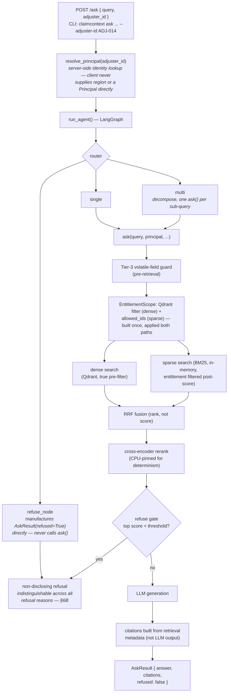
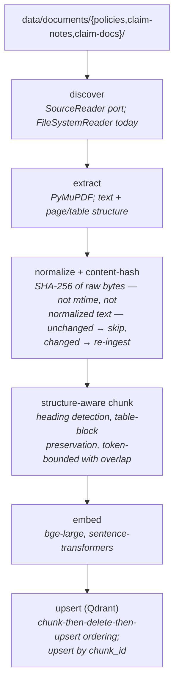

# ClaimContext

A grounded, cited Q&A assistant for insurance claim adjusters. It retrieves and cites the actual claim and policy documents — **it informs, it does not decide.** No automated claim decisions, no payout or coverage math; the system surfaces evidence, a human adjuster reasons about it.

---

## The problem

A claim adjuster answering a simple coverage question today hops across applications: a claims management system for status, a document imaging system for the policy PDF, another view for adjuster notes, and often a separate search for a specific endorsement that silently overrides a base exclusion. Each hop costs time, and the documents that actually answer the question — policy language, FNOL forms, damage estimates, investigation notes — are large, inconsistently structured, and easy to misread under time pressure. ClaimContext puts one question box in front of that document set and returns an answer with citations back to the exact source, so the adjuster can verify it rather than trust it blindly.

---

## What it does

- **Grounded, cited answers.** Every non-refused answer cites the specific document, page, and section it drew from. Citations are built from retrieval metadata, never parsed from LLM output.
- **Hybrid retrieval.** Dense (semantic) and sparse (BM25, exact-term) search fused by a hand-implemented Reciprocal Rank Fusion, then re-scored by a cross-encoder reranker.
- **Refusal when evidence is weak.** A reranker-score threshold gates generation; below it, the system says so instead of answering ungrounded. Refusal is a first-class, correct outcome, not an error.
- **Access control at the retrieval layer.** Entitlement (region + assigned adjuster) is enforced as a Qdrant filter and a BM25 allow-list, derived from one shared scope object, before any chunk reaches the LLM — never by prompting the model to behave.
- **Temporal validity.** Policy effective/expiry dates vs. a claim's loss date are captured at ingestion and reasoned about at query time — not precomputed into the corpus.
- **Volatile-data refusal.** Questions about current claim status, reserves, or payment history are refused, not answered from documents — those values live in a system of record no static document can reflect in real time.
- **An agent layer** (LangGraph) that routes a query to single retrieval, multi-part decomposition, or refusal, and composes multi-part answers from independently-grounded sub-answers — never by pooling raw retrieved context across claims.
- **Two evaluation harnesses**, not one: a RAG harness scoring answer content (RAGAS: context precision/recall, faithfulness, answer relevance) and a separate trajectory harness scoring the agent's *path* (route taken, escalation, cross-step provenance).
- **HTTP serving, a CLI, and a demo UI.** FastAPI (`/ask`, `/health`, `/ready`) plus the original CLI, plus a single-file HTML demo with a live adjuster switcher to make the entitlement boundary visible.
- **Optional tracing.** Langfuse instrumentation at the retrieval/rerank/generation/agent-routing boundaries, disabled by default, fail-open by design (verified live against an unreachable collector).

---

## Architecture

### Request flow



### Ingestion flow



### Component status

| Component | Status |
|---|---|
| Ingestion (discover/extract/normalize/chunk/embed/upsert) | **Built** |
| Dense + sparse retrieval, RRF fusion | **Built** |
| Cross-encoder rerank + refuse gate | **Built** |
| Entitlement pre-filter (dense true pre-filter; sparse post-score filter) | **Built** |
| Tier-3 volatile-data refusal | **Built** |
| Dedicated guardrails layer (PII redaction, prompt-injection detection, output-shape validation) | **Not built.** No such module exists. What's present is folded into the retrieval path: the refuse gate, the Tier-3 guard, and a prompt-level instruction to treat retrieved content as reference text, not instructions. No PII redaction code exists anywhere in the repo. |
| RAG eval harness (RAGAS) | **Built** |
| Agent orchestration (LangGraph: route, decompose, compose) | **Built** |
| Agent tools + hardening (timeouts, retry, MCP exposure) | **Built** |
| Trajectory-based agent eval | **Built** |
| HTTP serving (FastAPI) | **Built** |
| Observability (Langfuse tracing) | **Built**, disabled by default |
| Demo UI | **Built** — explicitly a demo affordance, not a production frontend; its adjuster selector is not authentication |
| Session memory / conversation checkpointing | **Not built.** `AgentState` is described as checkpointer-compatible; no checkpointer is wired in. |
| Caching (embedding / entitlement-scoped retrieval) | **Not built.** |
| Cloud deployment (Docker, ECS/Fargate, CI/CD) | **Not built.** No `Dockerfile`, no CI workflow in the repo. Documented as the target path, not implemented. |

---

## Key design decisions

**Hybrid retrieval, fused by hand-implemented Reciprocal Rank Fusion, not a library call.** Dense (cosine) and sparse (BM25) scores live on incompatible scales — they can't be meaningfully averaged. RRF fuses on rank position instead (`1/(k+rank)` per list a chunk appears in), which is scale-invariant. The trade-off is more moving parts than pure vector search, in exchange for exact-identifier queries (claim numbers, policy numbers, clause references) — which dense embeddings handle poorly — being found reliably.

**The refuse gate checks only the top reranked score against a fixed threshold.** Simple and interpretable, and it works because the reranker's absolute score range is meaningful (bge-reranker-base: ~0.97+ clearly relevant, ~0.5 the model's off-corpus uncertainty floor). The known limitation, documented rather than hidden: it answers "does the top score clear the bar," not "does the retrieved set contain the specific fact needed" — a same-claim, wrong-subtopic chunk can clear the bar while the correct evidence, ranked lower, never reaches the LLM. See `KNOWN_ISSUES.md` KI-1, found by the eval harness, not in production.

**Access control is enforced at retrieval, from server-resolved identity — never by prompting the model.** The client sends only an `adjuster_id`; region is resolved server-side and never accepted from the request. One `EntitlementScope` object builds both the dense-side Qdrant filter and the sparse-side allow-list, so the two paths cannot diverge on what "entitled" means. Honest nuance: the two paths are not mechanically symmetric — dense is a true pre-filter (non-entitled vectors are never scored), sparse is post-score filtering (BM25 scores the full in-memory corpus, then drops non-entitled results before fusion). Both are correct externally; only one excludes before scoring.

**The agent composes independently-grounded sub-answers, never pooled raw context.** For a multi-part query, each sub-query gets its own full `ask()` call — its own retrieval, its own refuse gate, its own entitlement check — and the final answer concatenates the results. The alternative (pool all retrieved chunks into one larger context window) would let one sub-query's context leak grounding for another, recreating exactly the cross-claim contamination the refuse gate exists to prevent.

**Ingestion idempotency is a SHA-256 hash of raw source bytes, not file modification time and not normalized text.** mtime is unreliable across filesystems and doesn't generalize to a future database-backed source. Hashing raw bytes (not post-normalization text) means a bug fix to the normalizer can never silently suppress a re-ingest that should happen. A failed extraction never updates the hash store, so it is retried on the next run rather than permanently marked "seen."

**Eval scoring treats refusal as a correct outcome, not a failure to penalize — and the regression gate is a documented allowlist, not a binary pass bar.** Each golden-set entry has an expected behavior (answer / refuse / Tier-3 refuse); correctness is judged against that label. The CI-style regression assertion fails on *any* failure not already in a named, root-caused exception set (`KNOWN_EVAL_EXCEPTIONS`) — new regressions are always caught; pre-existing, understood gaps don't block every future change until they're separately fixed.

---

## Tech stack

Exact versions from `uv.lock` / `pyproject.toml`.

**Runtime:** Python ≥3.11, `pydantic==2.13.4`, `pydantic-settings==2.14.2`, `python-dotenv==1.2.2`

**Document processing:** `pymupdf==1.28.0`, `tiktoken==0.13.0`

**Retrieval / storage:** `qdrant-client==1.18.0`, `rank-bm25==0.2.2`, `sentence-transformers==5.6.0` (bge-large embeddings, bge-reranker-base cross-encoder)

**LLM:** `ollama==0.6.2` (local default), `anthropic==0.120.2`, `openai==2.50.0`, `langchain-community>=0.3`, `langgraph>=1.2.10`, `langchain-core>=1.5.2`

**Eval:** `ragas==0.4.3`

**Serving:** `fastapi>=0.115`, `uvicorn[standard]>=0.32`, `httpx>=0.28.1`, `mcp>=2.0.0`

**Observability:** `langfuse>=4.14.4`

**Dev:** `pytest==9.1.1`, `mypy==2.3.0`, `ruff==0.15.22`, `black==26.5.1`

Full rationale per package: `DEPENDENCIES-LOCKED.md`.

---

## Getting started

### Prerequisites

- Python 3.11+
- [uv](https://docs.astral.sh/uv/)
- Docker (for Qdrant)
- [Ollama](https://ollama.ai/) running locally with `llama3.2` pulled, for the default local LLM provider

### Setup

```bash
make install          # uv sync --extra dev
cp .env.example .env  # edit as needed — no secrets are committed; .env is gitignored
make up                # docker compose up -d — starts Qdrant on :6333
```

### Ingest the corpus

```bash
uv run python scripts/generate_corpus.py   # generates the synthetic document set
uv run python -m claimcontext                # discover → extract → chunk → embed → upsert
```

### Ask a question

```bash
# CLI
uv run python -m claimcontext ask "For claim CLM-1004, is the wind-driven rain damage covered?" --adjuster-id ADJ-027

# HTTP API + demo UI
uv run uvicorn claimcontext.api.app:app --host 0.0.0.0 --port 8000
open http://localhost:8000        # the demo UI, same origin, no CORS
curl -X POST http://localhost:8000/ask -H 'Content-Type: application/json' \
  -d '{"query": "...", "adjuster_id": "ADJ-014"}'
```

### Run the checks

```bash
make lint        # ruff
make format      # black + ruff format check
make typecheck    # mypy
make test         # pytest — runs the FULL suite, including live-service proofs; no
                    # default marker exclusion exists in pyproject.toml, so this
                    # requires Qdrant + Ollama up (see below) or the live tests will fail
make check        # all of the above
```

### Run a subset, or the eval harnesses (require live Qdrant + Ollama; the RAGAS judge needs its own provider — see `.env.example`)

```bash
make eval            # full RAG eval harness (RAGAS scoring)
make eval-smoke       # 4-entry subset, ~1/8th the judge-call volume, for fast iteration
make eval-calibrate   # refuse_threshold calibration report

pytest -m agent            # live agent orchestrator proofs
pytest -m agent_eval        # live trajectory eval proofs
pytest -m api                # live FastAPI serving proofs
pytest -m observability      # live Langfuse tracing proofs (requires a reachable Langfuse instance)
pytest -m "not eval and not agent_eval and not observability"   # narrow the suite down when a judge/Langfuse isn't available
```

Live-service tests are pytest-marked (`retrieval`, `eval`, `agent`, `agent_eval`, `api`, `observability`) so a subset can be selected or excluded — but they are not excluded by default. `make test` / bare `pytest` runs all of them.

---

## Project status

Built incrementally, one functional boundary at a time. What exists is real and tested; what doesn't exist is not implied.

**Built:** ingestion, hybrid retrieval, entitlement, RAG eval, agent orchestration with hardening, trajectory eval, HTTP serving, observability, demo UI. All tested — see `tests/` for coverage (160 test functions across 15 files at last count).

**Designed but not built, in the order they'd come next:**
- A dedicated guardrails layer — PII redaction and prompt-injection detection currently don't exist as components; only the refuse gate and Tier-3 guard are built.
- The grounding-gate defect (`KNOWN_ISSUES.md` KI-1) — a same-claim, wrong-subtopic chunk can clear the refuse threshold while the correct evidence doesn't. A fix (query-aware sufficiency check, or output-faithfulness re-verification) is scoped but not implemented.
- Session memory — a LangGraph checkpointer, so a conversation could resolve a follow-up in-thread. The state schema was designed to make this additive.
- Entitlement-scoped caching.
- Cloud deployment and CI/CD — Dockerization, ECS/Fargate, a GitHub Actions pipeline. None of this exists in the repo today; it's a documented target, not a shipped artifact.

**Open defects:** tracked honestly in `KNOWN_ISSUES.md`, each with a severity, root cause, and status. Several are deliberately deferred rather than patched reflexively — the file explains why for each.

---

## Engineering notes — what this demonstrates

- **The evaluation harness caught a real grounding defect that functional tests did not.** A wrong-subtopic chunk from the same claim once cleared the refuse threshold while the actually-correct evidence, buried lower by a separate retrieval gap, never reached the LLM — producing a confident answer that cited the wrong claim's content. RAGAS scoring flagged it (`context_precision=0.0`); the failure is documented, not silently fixed and forgotten.
- **Environmental-failure testing (a genuinely unreachable dependency, not a mocked exception) found a bug that mocked-failure tests structurally could not.** The agent's router made its own unhardened Qdrant call that every prior mocked-failure test missed, because those tests all patched functions that only run *after* the router had already succeeded. Fixed the same day it was found.
- **A live test against an unreachable host once hung for 9.5 hours instead of failing fast**, which is not a footnote — it surfaced two real Qdrant clients in the codebase with no explicit timeout at all, unlike every other external call. Both fixed; the underlying lesson (never trust the network to fail fast; every external client needs an explicit timeout) is tracked as its own entry in `KNOWN_ISSUES.md`.
- **Every third-party library was verified against the installed version, not assumed from memory or documentation.** `qdrant-client` 1.8+ removed `.search()` in favor of `.query_points()`; the pinned `mcp` version exposes `MCPServer`, not the `FastMCP` class most examples reference; RAGAS 0.4.3's scoring API is a rewrite from the version most tutorials show. Each is called out in-code at the point it mattered, not discovered in production.
